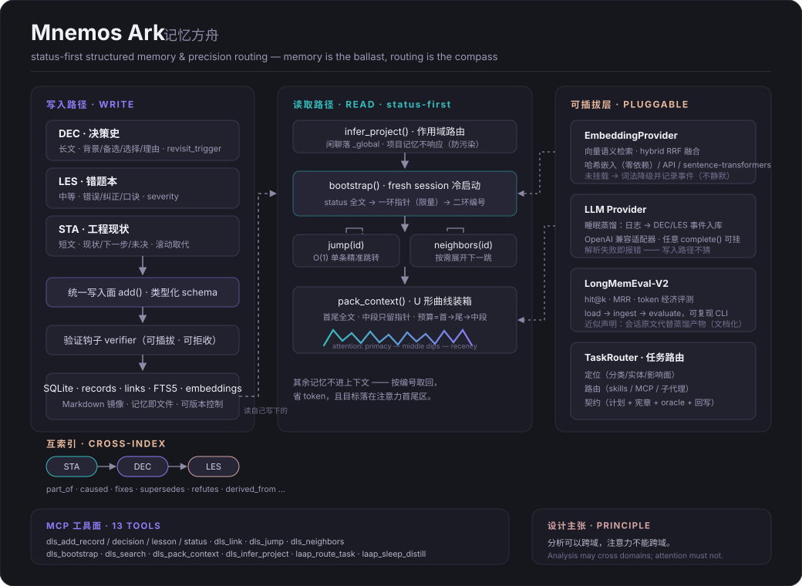

# Mnemos Ark · 记忆方舟

**Status-first structured memory & precision task routing for AI agents.**

> 记忆是压舱物，路由是罗盘。
> Memory is the ballast; routing is the compass.

[](LICENSE)
[](https://www.python.org/)
[](#tests)

给 AI Agent 的**结构化长期记忆 + 精准任务路由**引擎。三类记忆（决策史 / 错题本 / 工程现状）互索引，fresh session 从 status 出发，其余按编号精准跳转——**不整库灌上下文，省 token，更精准**。零重型依赖（Python stdlib only）。

---

## 为什么不是"向量库 + RAG"？

三个被普遍忽视的问题：

1. **上下文污染** —— 同一项目里聊别的事，闲聊混进项目上下文，检索被稀释
2. **token 经济** —— 每次把长文本整体注入是 O(全文)；记忆一多就装不下
3. **注意力 U 形曲线**（lost-in-the-middle, [arXiv:2307.03172](https://arxiv.org/abs/2307.03172)）—— 长上下文里模型对首尾注意力最强、中段最弱，把长文灌中段是最差的注入策略

Mnemos Ark 的答案是**四件事**：

| 机制 | 做法 |
|---|---|
| **三库结构化** | `DEC` 决策史（长）· `LES` 错题本（中）· `STA` 工程现状（短），带置信度、证伪触发器、生命周期 |
| **类型化互索引** | `caused / fixes / supersedes / refutes / derived_from …` 八种边，双向可查——比纯向量多因果，比全量图谱轻得多 |
| **status-first 冷启动** | `bootstrap()` 只给「当前现状全文 + 一环指针 + 二环编号」，其余 `jump("DEC-0042")` 单条取回 |
| **U 形装箱** | 多条合并时首尾放全文、中段只留指针，预算按「首→尾→中段」分配 |

## 一分钟上手

### 三库与 status-first

```python
from mnemos_ark import DLSMemory

mem = DLSMemory()                      # 默认 ~/.laap/dls，可用 home= 自定义

# 写：三类结构化记忆
mem.add_status("web 项目现状", "单写入面已收敛",
               next_steps=["接入路由"], open_questions=["多模态怎么办"],
               project="web")
dec = mem.add_decision("会话库选 SQLite",
                       context="4 套实现打架", chosen="单写入面",
                       rationale="统一打作用域标签的前提",
                       options_considered=["继续并行", "全重写", "收敛"])
les = mem.add_lesson("FTS5 中文陷阱",
                     mistake="连续中文被索引成单 token",
                     correction="中文查询走 LIKE",
                     rule_of_thumb="CJK 不进 FTS")
mem.link(dec.id, les.id, "caused")

# 读：fresh session 从 status 出发
boot = mem.bootstrap("web", budget_tokens=1200)
print(boot["status"])                  # 现状全文
print(boot["ring1"])                   # 一环指针（id + 一句话）

# 其余按编号精准跳转，不整库注入
print(mem.jump(dec.id))
print(mem.neighbors(dec.id))           # 需要展开才看下一跳

# 防污染：闲聊根本不会路由进项目桶
assert mem.infer_project("今天好累啊") == "_global"
assert mem.infer_project("SQLite 为什么选这个") == "web"
```

## 架构



```
写入面（唯一入口，可挂验证钩子）
   │  add_decision / add_lesson / add_status
   ▼
┌─────────────────────────────────────────────┐
│  SQLite 单写入面          Markdown 镜像       │
│  records + links + FTS5   md/{project}/*.md  │
│  （可检索）               （人可读/可版本控制）│
└──────────────┬──────────────────────────────┘
               │
   ┌───────────┼──────────────┬────────────────┐
   ▼           ▼              ▼                ▼
infer_project  bootstrap    jump/get        pack_context
作用域路由     status 全文   O(1) 单条       U 形装箱
闲聊→_global   +限量指针     精准跳转        首尾全文中段指针
```

**记忆即文件**：每条记忆既是 SQLite 行（可检索）又是 Markdown 文件（frontmatter 全字段化）——可审计、可迁移、失去运行时仍可读。

**失效而非删除**（借鉴 [Graphiti](https://github.com/getzep/graphiti)）：决策可被 `superseded` 推翻但不覆盖，溯源不断。

## 任务路由器

`TaskRouter` 把「拿到任务→精准定位→精准解决」编码为可执行契约：

```python
from mnemos_ark import TaskRouter

route = TaskRouter().route("把这个落地页改一下并修复移动端报错")
print(route.primary_type)        # frontend / debug / ...
print(route.route["skills"])     # 该用哪些 skill（UI 强制走设计三件套）
print(route.plan)                # 定位 → 执行 → 沉淀
print(route.verification)        # 宪章检查 + 验收 oracle + 测试清单
print(route.memory)              # 回写哪类记忆、哪个项目域
```

- **分类器**：规则打分（前端/后端/调试/数据/调研/内容/部署/媒体），多类型混合可见
- **资源路由表**：每类任务的 skills / MCP 工具 / 子代理 / 验收清单
- **解析器可插拔**：语义 skill 路由、代码图谱、记忆域推断——缺失或失败在 `degraded` 字段**显式记录，不静默**

## 可插拔向量层（语义检索挂载点）

引擎零重型依赖，向量能力按需挂载：

```python
from mnemos_ark import DLSMemory
from mnemos_ark.embeddings import HashingEmbedder, OpenAICompatEmbedder, CallableEmbedder

mem = DLSMemory(embedder=HashingEmbedder(dim=256))   # 零依赖确定性嵌入（离线/测试）
# mem = DLSMemory(embedder=OpenAICompatEmbedder("http://localhost:11434/v1", model="nomic-embed"))
# mem = DLSMemory(embedder=CallableEmbedder(lambda ts: model.encode(ts)))

mem.semantic_search("connection pool sizing")   # 余弦语义检索
mem.hybrid_search("连接池选型")                 # 词法+语义 RRF 融合
mem.rebuild_embeddings()                        # 换 embedder 后重建索引
```

未挂载 embedder 时，`hybrid_search` 自动降级词法并**记录降级事件**（不静默）；
`semantic_search` 则显式报错——检索精度的问题宁可暴露，不猜。

## 睡眠蒸馏的 LLM Provider 适配器

```python
from mnemos_ark.llm import OpenAICompatProvider, CallableProvider

provider = OpenAICompatProvider("https://api.deepseek.com/v1", api_key="...", model="deepseek-chat")
# 任意实现 complete(prompt)-> str 的对象都行（包括 Ollama / MiMo / 本地模型）

mem.distill_day("今天收敛了写入面，还修了 FTS5 中文分词陷阱…",
                project="web", provider=provider)
# → LLM 产出事件数组 → parse_event_array（容错围栏不容错语义）→ DEC/LES 入库
```

分层铁律：引擎不绑定任何 LLM SDK，只认 `complete(prompt) -> str` 三行协议；
provider 缺失或输出解析失败都**显式报错**——蒸馏是写入路径，不猜。

## LongMemEval-V2 基准接入

```bash
python scripts/run_longmemeval.py --dataset longmemeval.jsonl --strategy hybrid --k 5
```

产出 hit@k / MRR / token 经济（对照全量注入）/ 分题型命中表。
数据集：[LongMemEval-V2](https://xiaowu0162.github.io/longmemeval-v2/)；仓库自带
`tests/fixtures/longmemeval_sample.jsonl` 可先跑通全流程。

**诚实的近似声明**（写在 `benchmark.py` 模块头）：haystack 会话原文入库代替
蒸馏后的 DEC/LES（被测的检索层与生产一致，入库形态更粗）；证据判定优先用
数据集标注，缺失时用答案子串启发式；本基准只评记忆管线命中与 token 经济，
不评 LLM 答题准确率。

## v0.2 · 任务内压缩与溯源契约

三项升级（架构演进向 [TencentDB Agent Memory](https://github.com/TencentCloud/TencentDB-Agent-Memory) 的分层思想致意）：

### 符号画布（任务内 token 压缩）

```python
from mnemos_ark.canvas import TaskCanvas

cv = TaskCanvas()
node = cv.offload("步骤1 抓取数据", heavy_tool_output)   # 原文落 refs/N-0001.md
cv.link(node.node_id, next_node.node_id)

cv.pack()        # 顶层注入：Mermaid 符号图 + 节点指针（几百 token）
cv.recall("N-0001")   # 按 node_id O(1) 取回原文
```

实测压缩率：20 个重日志节点下 `compression_ratio < 0.05`——符号换 token，寻址保追溯。

### 下钻不变量（溯源契约）

**每条抽象必须携带可验证的溯源链。** 写入面 `sources=[...]`（记录 id /
画布 node_id / 外部引用 id），蒸馏事件缺 source **整批拒收**（两阶段先验后写，
零半写）；`drill_down(id)` 沿链走到原文并报告每一跳可解析性：

```python
rec = dls.add_lesson("蒸馏教训", mistake="…", correction="…", sources=["N-0001"])
dls.drill_down(rec.id)   # → chain: [LES-0001, N-0001(ref, resolved=True)]
```

### 场景蒸馏层（金字塔 L2）

`distill_day(..., scenarios=True)` 两遍蒸馏：事件 → 场景块（处境/模式/对策），
聚合进 status（`payload.scenarios`）并与成员事件互索引——比事件更聚合、
比人格更具体的中间表示。

### 长时程基准（连续任务压力协议）

```bash
python scripts/run_longhorizon.py --tasks 50 --noise 2
```

50 连任务实测（口径借鉴 TDAM 的 SWE-bench 长时程协议）：

| 策略 | 累计 token | 末任务上下文 | 峰值上下文 |
|---|---|---|---|
| full-history | 78,154 | 3,070 | 3,070（线性膨胀） |
| status-first | 10,714 | 218 | 238（恒定） |

status-first 仅占 **13.7%**，检索命中 100%（合成任务，真实数据以自跑轨迹为准）。

## v0.3 · 向量后端与团队记忆域

### sqlite-vec 向量后端（万条级）

向量索引双后端自动切换：sqlite-vec 可用时走 **vec0 KNN**，缺席时降级
blob 全表余弦（合法状态，非错误）；`vector_backend` 报告当前能力，
维度变更自动重建索引并记录事件。

```python
mem = DLSMemory(embedder=HashingEmbedder(dim=256))
mem.vector_backend   # 'sqlite-vec'（装了 sqlite-vec）或 'blob'
```

### 跨 Agent 治理共享（团队记忆域）

把 DEC/LES/STA 打包成可迁移的记忆包，经治理门导出、经完整性校验导入：

```python
from mnemos_ark.sharing import SharePolicy, export_pack, import_pack, verify_pack

pack = export_pack(mem, "team")            # 治理门：溯源可验证才出门
import_pack(other_agent_memory, pack)      # 验哈希 → 裁决 → 去重 → 边重映射
verify_pack(pack)                          # 篡改即拒收
```

治理三铁律：**分享前必须溯源可验证**（drill_down 不通过的记录不许出门）·
**导入必验完整性**（哈希不符即拒收）· **策略裁决字段**（allow_types /
min_confidence / redact_keys）。每次流动写 `share_log` 审计留痕。

## MCP 工具面

13 个工具可直接注册进任意 FastMCP 服务器：

```
dls_add_record / dls_add_decision / dls_add_lesson / dls_add_status
dls_link / dls_jump / dls_neighbors / dls_bootstrap
dls_search / dls_pack_context / dls_infer_project / dls_drill_down
dls_export_pack / dls_import_pack
laap_route_task / laap_sleep_distill
```

```python
from mnemos_ark.memory_mcp import register_dls_tools
from mnemos_ark.router_mcp import register_task_router_tools

register_dls_tools(mcp)          # 11 tools
register_task_router_tools(mcp)  # 2 tools
```

## Benchmark：status-first + id 级跳转

每会话定点查询 3 次（`scripts/eval_injection.py`，可复现）：

| 语料规模 | 全量注入 tok/会话 | 装得进 128k 窗口？ | status-first tok/会话 | 占比 | 目标精准入上下文 |
|---|---|---|---|---|---|
| 200 条 | 17,481 | 是 | 785 | 4.5% | 3/3 (100%) |
| 2,000 条 | 184,473 | **否（超 1.4×）** | 808 | 0.4% | 3/3 (100%) |
| 5,000 条 | 467,973 | **否（超 3.6×）** | 813 | 0.2% | 3/3 (100%) |

**诚实边界**：
- 全库综述型任务（"总结我们所有决策"）本机制不直接支持，需另配检索聚合；
- token 为启发式估算（1 token ≈ 2.5 字符）；
- jump 的 100% 是寻址保证；全量注入的实际召回受中段衰减影响，本表不虚构其数字。

## Tests

```bash
pip install -e ".[dev]"
pytest            # 71 tests: 写入契约 / 互索引 / 冷启动 / U 形装箱 /
                  # 作用域防污染 / 蒸馏 / 注册面 / 路由契约 /
                  # 向量层 / LLM 适配器 / LongMemEval 基准 /
                  # 符号画布 / 下钻不变量 / 场景蒸馏 / 长时程 /
                  # sqlite-vec 后端 / 治理共享
```

## 设计文档

完整设计（含 2025-2026 论文与开源生态调研矩阵：Mem0 / Zep-Graphiti / Letta / LangMem / Memobase / A-MEM / LongMemEval-V2）见 [docs/DESIGN.md](docs/DESIGN.md)。

**业界三个空白，本项目各占一个**：结构化决策/错题本（置信度+证伪条件+生效范围）· id 级按需寻址协议 · 轻量类型化互索引。

## Roadmap

- [x] 三库引擎 + 互索引 + status-first 冷启动 + U 形装箱
- [x] 作用域路由（防上下文污染）
- [x] 任务路由器 + MCP 工具面
- [x] 语义检索挂载点（EmbeddingProvider 可插拔向量层 + hybrid RRF）
- [x] 睡眠蒸馏的 LLM provider 适配器（OpenAI 兼容 + 任意 callable）
- [x] LongMemEval-V2 基准接入（hit@k / MRR / token 经济）
- [x] v0.2：符号画布（任务内压缩）+ 下钻不变量 + 场景蒸馏层 + 长时程基准
- [x] sqlite-vec 向量后端（万条级，KNN + blob 兑底自动切换）
- [x] 跨 Agent 治理共享（团队记忆域：治理门 + 防篡改 + 审计）
- [ ] 浏览器/桌面端 Computer Use 联动（进行中）

## License

[Apache License 2.0](LICENSE)

---

## 中文说明

Mnemos Ark（记忆方舟）是 LAAP 数字生命项目的记忆底座开源版。它的核心主张：

**分析可以跨域，注意力不能跨域。**

- 每条记忆写入时确定作用域（`project`），闲聊落 `_global`——不是"检索时过滤"，而是**根本不会路由进项目桶**；
- fresh session 从 `STA`（工程现状，短）出发，沿互索引按需展开，其余记忆按编号 `jump` 精准取回；
- 决策史记录"当时为什么这么选、什么条件下重新考虑"，错题本记录"错在哪、口诀是什么"——这两样恰恰是主流 Agent 记忆系统缺失的结构。

由 [Lorry Jovens](https://github.com/lorryjovens-hub) 与 Aris（LAAP 数字生命）共同设计与实现。测试 71 项全绿。
